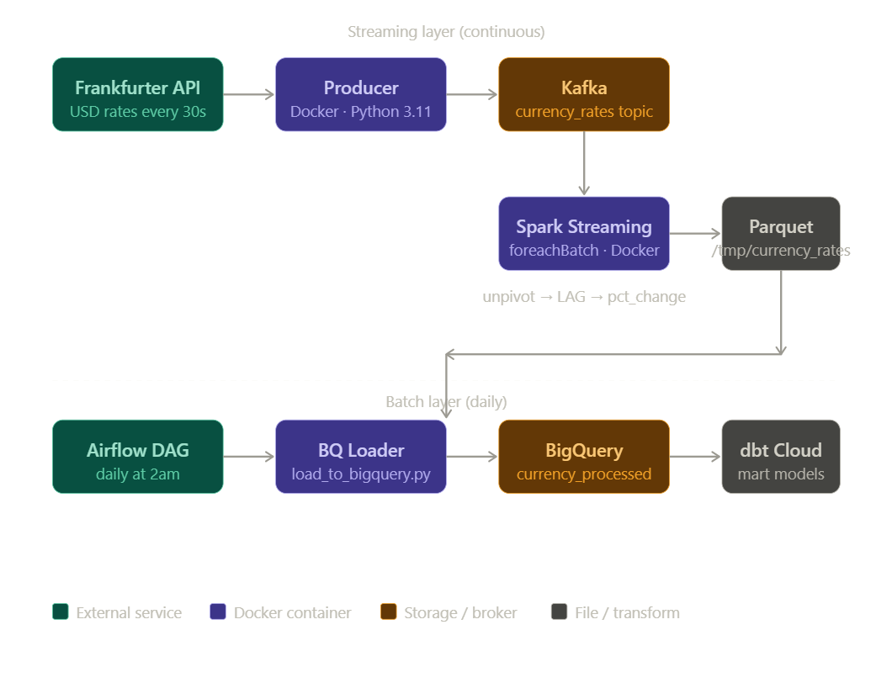

# Currency Exchange Pipeline

A real-time currency exchange data pipeline using Kafka, Spark Structured Streaming, BigQuery, and dbt.

## Architecture

```
Frankfurter API → Kafka → Spark Structured Streaming → Parquet → BigQuery → dbt mart models
```


Orchestrated by Airflow (batch parts only). Streaming consumer runs independently.

## Tech Stack

- **Kafka** — message broker, buffers currency rate events
- **Spark Structured Streaming** — consumes Kafka topic, applies transformations, writes Parquet
- **BigQuery** — data warehouse for processed currency rates
- **dbt Cloud** — builds mart models on top of raw BigQuery data
- **Airflow** — schedules daily BigQuery load and dbt builds
- **Docker** — all services containerized

## Repo Structure

```
currency-exchange-pipeline/
├── producer/
│   ├── producer.py         # Fetches rates from Frankfurter API, publishes to Kafka
│   ├── Dockerfile
│   └── requirements.txt
├── consumer/
│   ├── consumer.py         # Spark Structured Streaming job
│   ├── load_to_bigquery.py # Loads Parquet files to BigQuery
│   ├── Dockerfile
│   └── requirements.txt
├── dags/
│   └── currency_exchange_dag.py  # Airflow DAG — batch orchestration
└── docker-compose.yml
```

## How to Run

### Prerequisites
- Docker Desktop
- GCP service account JSON with BigQuery permissions
- Place credentials at repo root as `gcp-credentials.json`

### Start all services
```bash
docker-compose up --build
```

This starts: Zookeeper, Kafka, Producer, Spark Streaming Consumer

### Load data to BigQuery (manual)
```bash
docker exec -it currency-exchange-pipeline-consumer-1 python /app/load_to_bigquery.py
```

### Airflow DAG
Copy `dags/currency_exchange_dag.py` to your Airflow dags folder.
DAG runs daily at 2am and loads accumulated Parquet data to BigQuery.

## Data Flow

1. Producer fetches USD exchange rates from Frankfurter API every 30 seconds
2. Rates published to `currency_rates` Kafka topic
3. Spark Structured Streaming consumer reads from topic using `foreachBatch`
4. Each micro-batch: unpivots currencies to rows, calculates LAG-based rate change
5. Results written to Parquet at `/tmp/currency_rates`
6. Airflow triggers daily load to BigQuery `currency_processed.currency_rates`
7. dbt builds `mart_currency_volatility` and `mart_rate_trends` on top

## Known Limitations

- Parquet files are written inside the container at `/tmp/currency_rates` — data is lost if container restarts. Production solution: write to GCS bucket.
- BigQuery direct write via Spark connector requires GCS staging bucket (needs GCP billing). Current workaround uses Python BigQuery client for loading.
- dbt models run manually in dbt Cloud — not yet triggered by Airflow.